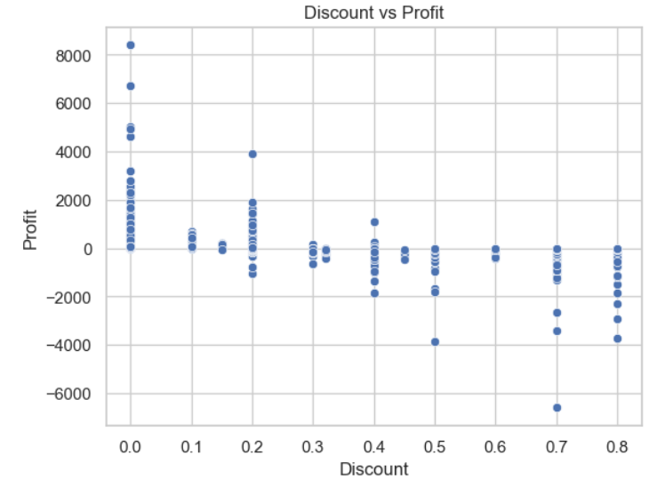

# Retail Profit Analysis (Kaggle Superstore)

Quick analysis of a retail dataset to identify which regions, products, and customer segments are driving profit or loss, and to provide actionable recommendations.

## Dataset Source
Below is the dataset link from the Kaggle website:
https://www.kaggle.com/datasets/vivek468/superstore-dataset-final

## Data Analysis Tools
 - Jupyter Notebook from Anaconda 
 - Python libraries: Pandas, Seaborn and Matplotlib

## How to Run
 - Copy the repo
 - Open Notebook
 - Run all cells

## Key Insights
 - The West region is the most profitable, while the Central region underperforms.
 - Furniture has relatively lower profit compared to its sales volume.
 - High discounts (above ~30%) are often associated with negative profit.
 - The Consumer segment generates higher total profit than other segments.

